# Object Detection using YOLO

This project was developed for educational purposes.

The main objective is to gain hands-on experience with the end-to-end workflow of a real computer vision project. This includes dataset collection, annotation, model training, and evaluation in a collaborative development environment.

The model is trained to detect three everyday objects:

- red cup
- blue bottle
- phone

## Dataset collection

Images for the dataset were collected from multiple sources in order to increase variability and improve the robustness of the trained model.

For objects that were easily accessible, such as the blue bottle and the phone, a large number of images were captured manually using different devices and under varying conditions. This includes variations in lighting, background clutter, object orientation, scale, and distance from the camera.

To further expand the dataset and introduce additional visual diversity, publicly available images were gathered from online sources such as [Pexels](https://www.pexels.com/), [Unsplash](https://unsplash.com/), and [Pixabay](https://pixabay.com/), as well as through Google Image Search.

Combining self-captured and externally sourced images helped ensure a broader distribution of visual contexts and reduced the risk of overfitting to a narrow set of environments.

At a later stage, we also added a second dataset with augmented images from Roboflow to see if this would perform better.

## Labelling of images in the dataset

All images in the dataset were annotated using [Roboflow](https://roboflow.com/).

Manual annotation was used for the entire dataset to ensure consistent labeling quality across all classes. In most cases, objects were annotated using axis-aligned bounding boxes, which is the standard annotation format for YOLO-based object detection models.

In a small number of images where objects overlapped significantly or had irregular visible shapes, polygon segmentation was used during annotation to more accurately capture the object extent. These annotations were later converted to bounding box representations for training.

This mixed annotation approach helped improve labeling precision while maintaining compatibility with the YOLOv8 training pipeline.

### Examples of labelled images

Original image                            |  Labelled image
:----------------------------------------:|:-------------------------:
   |  
     |  
  |  

## Training results

To analyse the learning behaviour of the model, training and validation metrics were monitored across several experimental runs. These included training on the original dataset for 20 and 50 epochs, and on the augmented dataset for 20, 50 and 100 epochs.

### Loss development

Across all experiments, the training losses (box loss, classification loss, and distribution focal loss) show a consistent downward trend. This indicates that the model successfully learns to localise objects and distinguish between classes as training progresses.

For shorter training runs (20 epochs), the losses decrease rapidly during the first epochs and then begin to stabilise. This suggests that the model quickly captures basic visual patterns but does not yet converge to a fully optimised solution.

Longer training runs, especially those using data augmentation, result in a more gradual and sustained reduction in loss values. This behaviour is typical when the model continues refining its internal representations and improving localisation accuracy.

Validation losses follow a similar overall trend but are noticeably more noisy. This is likely due to the relatively small size of the validation set and the limited diversity of the dataset. Occasional spikes in validation loss suggest that the model may still be sensitive to specific image conditions or object configurations.

### Precision and recall

Precision generally increases throughout training, particularly in runs with more epochs and augmented data. This indicates that the model becomes more confident and produces fewer false positive detections over time.

Recall improves more slowly and shows higher variance across epochs. This suggests that while the model learns to make more accurate predictions, it still occasionally fails to detect all objects present in an image. This behaviour is consistent with the confusion matrix observations, where some objects are classified as background.

### Mean Average Precision (mAP)

The mAP metrics show a clear upward trend as training progresses. Both mAP@50 and mAP@50-95 improve significantly during the early stages of training and continue to increase more gradually in later epochs.

Training on the augmented dataset yields more stable improvements and slightly higher final mAP values compared to training on the original dataset. This confirms that increased dataset variability helps the model generalise better.

However, the performance gains diminish at higher epoch counts, indicating that the model begins to approach its capacity given the current dataset. Further improvements would likely require additional training data, more balanced class distributions, or refined augmentation strategies.

### Overall interpretation

The training curves demonstrate that the model is able to learn meaningful object representations and improve detection performance over time. Data augmentation plays an important role in stabilising training and supporting better generalisation.

At the same time, the remaining variance in validation metrics and the saturation of mAP suggest that dataset size and diversity remain the main limiting factors. Expanding the dataset and introducing more challenging scenarios would likely lead to further performance gains.

- **Results of 20 epochs on the augmented dataset**

    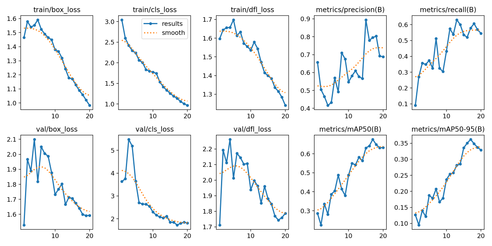

- **Results of 50 epochs on the augmented dataset**

    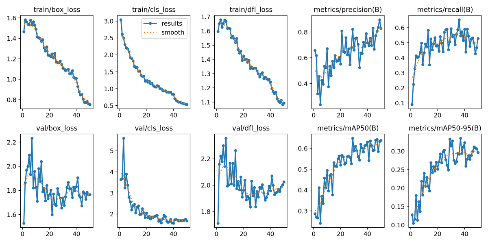

- **Results of 100 epochs on the augmented dataset**

    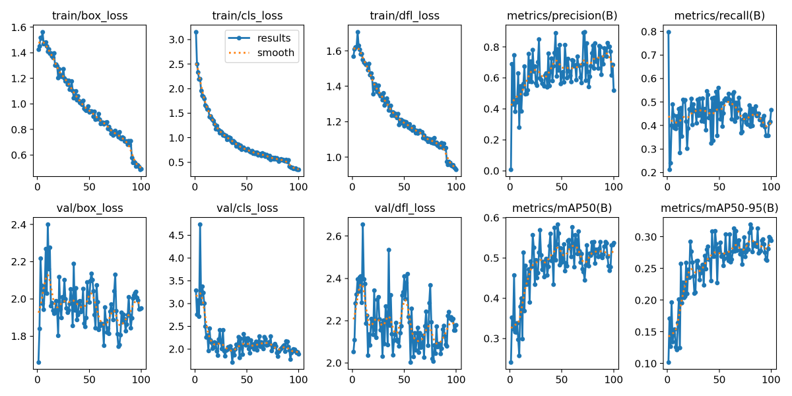

### Confusion matrix analysis

Dataset   | 20 epochs                                       |  50 epochs                                      |  100 epochs
:--------:|:-----------------------------------------------:|:-----------------------------------------------:|:-------------------------:
Original  | 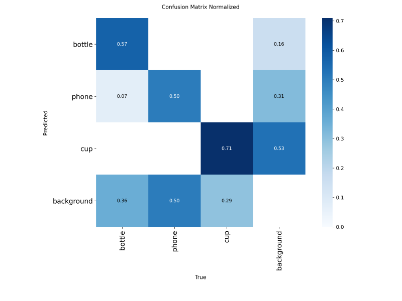   | 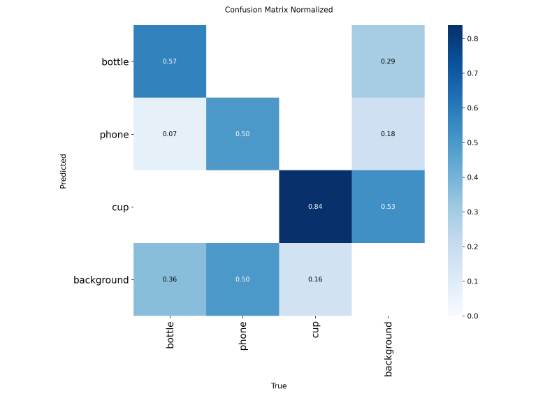   |  X
Augmented | 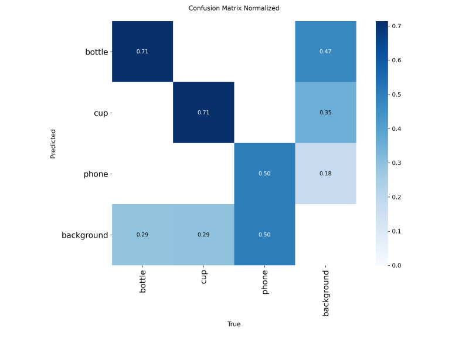 | 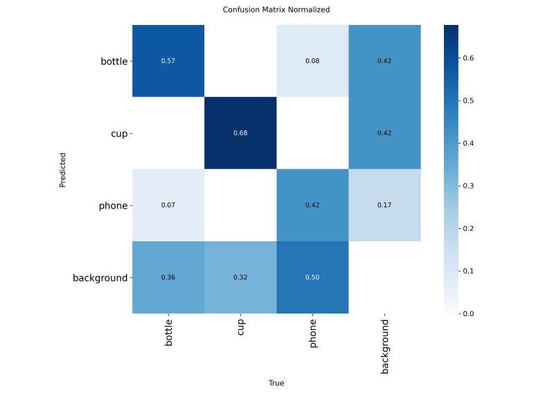 | 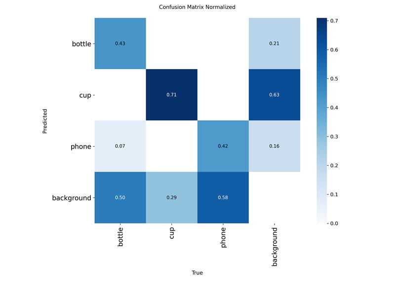

To evaluate the effect of training duration and data augmentation, several training runs were performed using different numbers of epochs. Experiments were conducted on both the original dataset and an augmented version of the dataset. Training was carried out for 20 and 50 epochs on the original dataset, and for 20, 50, and 100 epochs on the augmented dataset.

1. Performance on the original dataset

    When training on the original dataset, the model shows moderate class recognition performance after 20 epochs. The confusion matrices indicate that the model is already able to correctly detect bottles and cups in a significant portion of cases, while phone detection remains more challenging. A relatively large share of objects is still classified as background, which suggests that the model has not yet learned sufficiently robust object representations.

    Increasing the training duration to 50 epochs improves class discrimination slightly. The model becomes more confident in detecting cups and bottles, and the number of correct detections increases. However, confusion with the background class remains a major source of error. This indicates that the limited variability of the original dataset may restrict further improvements, even with longer training.

2. Performance on the augmented dataset

    Training on the augmented dataset leads to more stable and generally improved performance. After 20 epochs, the model already shows comparable or better recognition rates than the original dataset at the same training length. Data augmentation appears to help the model generalize better to different object appearances and environments.

    At 50 epochs, the confusion matrices show clearer separation between classes. In particular, cup detection improves significantly, and the model makes fewer background misclassifications compared to earlier runs. Bottle recognition remains relatively consistent, while phone detection still presents some difficulty, likely due to higher visual variability and smaller object size in some images.

    Extending training to 100 epochs further strengthens performance for certain classes, especially the cup class, which achieves the highest correct classification rates in the experiments. However, the improvement is not uniform across all classes. Some confusion between phones and background remains, suggesting that additional data or more targeted augmentation strategies may be required.

#### General observations

Across all experiments, the background class represents the dominant source of misclassification. This is common in object detection tasks when objects appear small, partially occluded, or under challenging lighting conditions. The results suggest that both dataset diversity and sufficient training time are important factors for achieving robust detection performance.

Overall, the augmented dataset combined with longer training provides the best results. These findings highlight the importance of data augmentation in improving model generalization and reducing overfitting when working with relatively small custom datasets.

## Real-world performance and limitations

The model’s performance in real-world scenarios could likely be improved by training on a more diverse and extensive dataset. In particular, additional variation in backgrounds, lighting conditions, object orientations, and camera distances would help the model learn more robust visual representations.

Despite these limitations, the model demonstrates reasonably good practical performance. During webcam-based testing, the trained detector was able to correctly identify the target objects in many situations. Detection was generally reliable when objects were clearly visible, well lit, and placed against relatively simple backgrounds.

However, several common failure cases were observed. The model occasionally struggled to detect objects when they appeared on complex or cluttered backgrounds, or when lighting conditions were poor. In some instances, parts of the background were incorrectly classified as one of the target objects, resulting in false positive detections.

Another recurring issue was confusion between visually similar object configurations. For example, the phone was sometimes (on the model with 50 epochs) misclassified as a cup depending on how it was held or partially occluded. This suggests that the model relies strongly on coarse shape and contextual cues, and that additional training data showing phones in varied poses could improve class separation.

Examples of real-world detections are shown below.

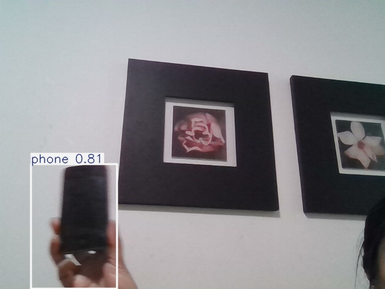
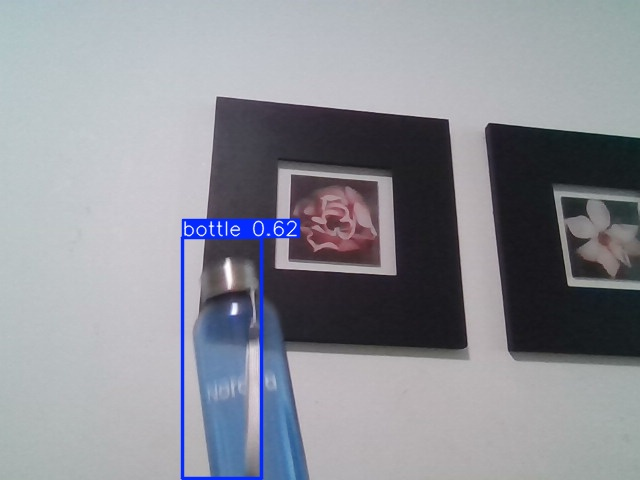
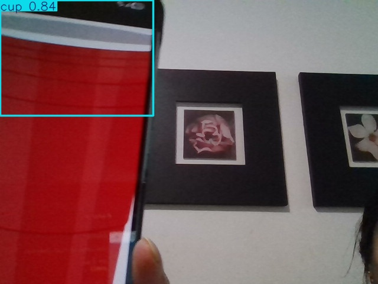
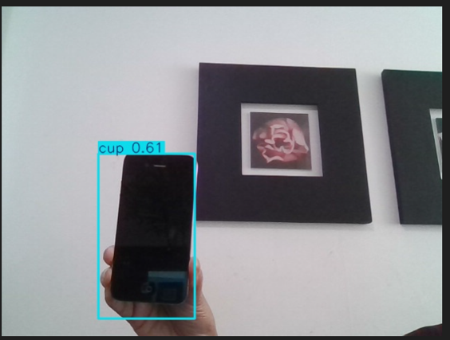

## Conclusion and future work

In this project, a custom object detection model was successfully trained using YOLOv5 to recognise three everyday objects: a red cup, a blue bottle, and a phone. The workflow covered the complete development process of a computer vision system, including dataset collection, annotation, model training, evaluation, and real-world testing.

The experimental results show that the model is capable of learning meaningful visual features and achieving reasonable detection performance, especially when trained for a sufficient number of epochs and with the help of data augmentation. Training curves and confusion matrix analysis indicate steady improvements in localisation accuracy, classification confidence, and overall detection quality. Real-world webcam tests further demonstrate that the model can operate in practical scenarios under favourable conditions.

However, the experiments also highlight several limitations. Detection performance is still sensitive to background complexity, lighting variation, and object pose. In particular, confusion between certain object configurations and the background class remains a significant source of error. These findings suggest that the main bottleneck is the size and diversity of the dataset rather than the model architecture itself.

Future work could focus on expanding the dataset with more varied environments, object instances, and challenging conditions such as occlusion and motion blur. Additional improvements could also be achieved by refining augmentation strategies, tuning training hyperparameters, or experimenting with more recent object detection architectures. Overall, the project demonstrates both the potential and the practical challenges of developing a custom object detection system on a limited dataset.
