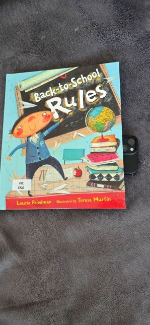
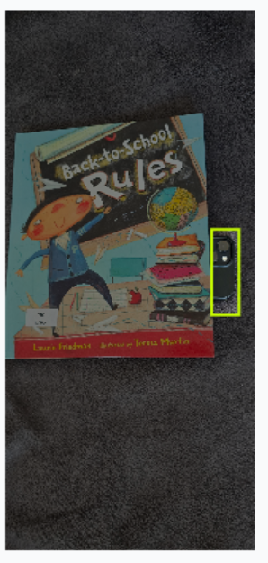
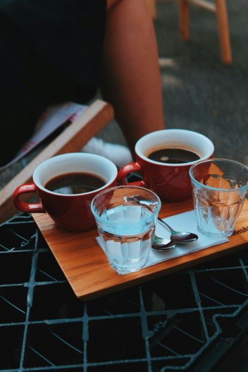
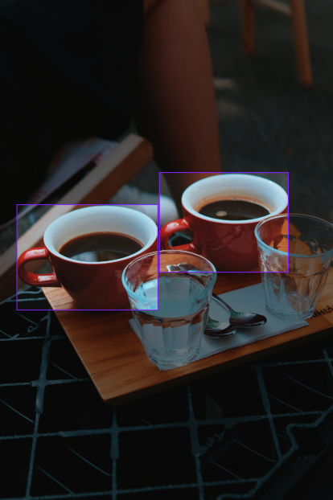
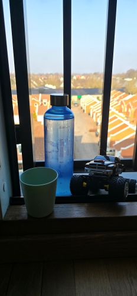
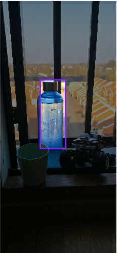

# Object Detection using YOLO

This project was developed for educational purposes.

The main objective is to gain hands-on experience with the end-to-end workflow of a real computer vision project. This includes dataset collection, annotation, model training, and evaluation in a collaborative development environment.

The model is trained to detect three everyday objects:

- red cup
- blue bottle
- phone

## Dataset collection

Images for the dataset were collected from multiple sources in order to increase variability and improve the robustness of the trained model.

For objects that were easily accessible, such as the blue bottle and the phone, a large number of images were captured manually using different devices and under varying conditions. This includes variations in lighting, background clutter, object orientation, scale, and distance from the camera.

To further expand the dataset and introduce additional visual diversity, publicly available images were gathered from online sources such as [Pexels](https://www.pexels.com/), [Unsplash](https://unsplash.com/), and [Pixabay](https://pixabay.com/), as well as through Google Image Search.

Combining self-captured and externally sourced images helped ensure a broader distribution of visual contexts and reduced the risk of overfitting to a narrow set of environments.

## Labelling of images in the dataset

All images in the dataset were annotated using [Roboflow](https://roboflow.com/).

Manual annotation was used for the entire dataset to ensure consistent labeling quality across all classes. In most cases, objects were annotated using axis-aligned bounding boxes, which is the standard annotation format for YOLO-based object detection models.

In a small number of images where objects overlapped significantly or had irregular visible shapes, polygon segmentation was used during annotation to more accurately capture the object extent. These annotations were later converted to bounding box representations for training.

This mixed annotation approach helped improve labeling precision while maintaining compatibility with the YOLOv5 training pipeline.

### Examples of labelled images

Original image                            |  Labelled image
:----------------------------------------:|:-------------------------:
   |  
     |  
  |  

## Training results

We tried training our model for different numbers of epochs, ranging from 3 for the initial tests up to 50 epochs. As expected, the performance differed vastly between the different tries.

## Performance in real world scenarios
